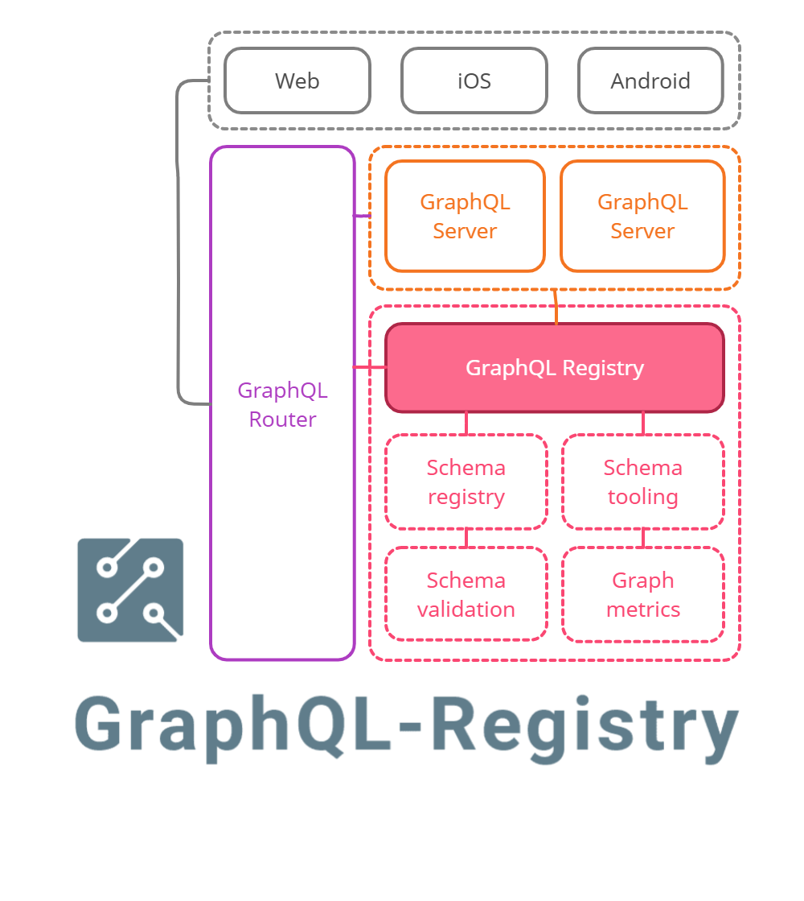

<div align="center">
  
</div>

<br>

<div align="center">
  <a href="https://github.com/StarpTech/graphql-registry/actions?query=workflow%3ACI">
    
  </a>
  <a href="https://github.com/StarpTech/graphql-registry/actions?query=workflow%3ABENCH">
    
  </a>
  <a href='https://coveralls.io/github/StarpTech/graphql-registry?branch=main'></a>
</div>

<br/>

> There should be a **single source of truth** for registering and tracking the graph.

## Features

- Create multiple graphs (for example, staging and production, or different development branches)
- Stores versioned schemas for all GraphQL-federated services
- Serves schema for GraphQL gateway based on provided services & their versions
- Serves a supergraph schema for the GraphQL gateway
- Validates new schema to be compatible with other running services
- Validates that all client operations are supported by your schema
- Calculates a schema coverage report from GraphQL operations
- Validates if a schema update produce a breaking, dangerous or safe change
- Lightweight authorization concept based on JWT.

[**Read more**](https://principledgraphql.com/integrity#3-track-the-schema-in-a-registry)

## Examples

- [Federation](./examples/mercurius-federation) with Mercurius.
- [Federation](./examples/apollo-federation) with Apollo Gateway.
- [Managed Federation](./examples/apollo-managed-federation) with Apollo Gateway.

## API

Try all endpoints in [insomnia](https://insomnia.rest/run/?label=GraphQL%20Registry&uri=https%3A%2F%2Fraw.githubusercontent.com%2FStarpTech%2Fgraphql-registry%2Fmain%2Finsomnia.json) or read the api [documentation](./docs/api.md).

## Development

Copy `.env.example` to `.env`

```sh
# Install project
npm install
# Start postgres
docker-compose up postgres
# Create db schema
npm run migrate:up
# Watch mode
npm run dev
# Run tests
npm run test
```

## Benchmark

Run a benchmark with:

```sh
docker-compose up postgres
docker-compose up --build app
docker-compose run k6 run /benchmark/composed-schema.js
```

Our benchmark suite is running in the CI.

## Deployment

GraphQL-Registry uses by default postgres as database.

```sh
# Bootstrap database
npm install && npm run migrate:up
# Run service
docker run -e DATABASE_URL="" starptech/graphql-registry:latest -p 3000:3000
```

[Available](/src/core/env.schema.ts) environment variables.

## Alpha version

GraphQL Registry is currently highly under development. It means that we are still working on essential features like production-ready schema management, graph metrics and development tooling. GraphQl Registry can be evaluated anytime. Every feature is covered by integration tests. We rely on your feedback and sponsorship. Feel free to open an issue or feature request!

## Contributing

❤️ contributions!

I will happily accept your pull request if it:

- has tests
- looks reasonable
- follows the [code of conduct](./CODE_OF_CONDUCT.md)

### License

GraphQL Registry is open-source under the GNU Affero General Public License Version 3 (AGPLv3) or any later version. You can [find it here](LICENSE).
Why AGPLv3 and not MIT? Read the blog post from [plausible](https://plausible.io/blog/open-source-licenses) to learn more about our motivations.
