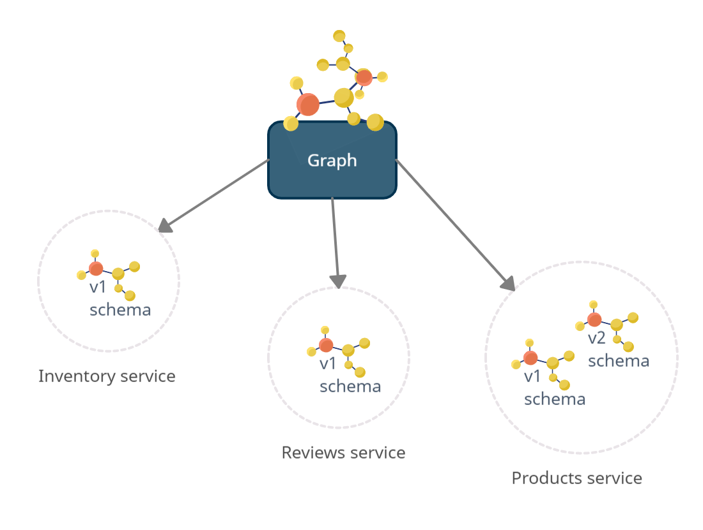

# Composition stability

Whenever a schema is pushed or fetched, Graph-Registry ensures that the schema is valid. You can't fetch or push an invalid schema.

# Terminology

## One graph, many services

<div align="center">
  
</div>

- **Graph:** A graph consists of multiple schemas managed by different services. You can create multiple graphs to build any variant. From consumer perspective, the composed graph state is determined and validated at runtime.
  Every schema is associated to a single service.
- **Schema:** A schema describes the shape of the data graph of a single graphql server. A schema is always associated to one service.
- **Service:** A service represent a unique graph-server in your infrastructure for example `Products`. A service can manage multiple schemas in different versions (e.g `v1`, `v2`, `current`). The `current` version is [special](#register-a-schema). The term `service` reflects the real-world. There must be a federated service which is responsible to manage the schema.

# API

## Schema federation

### Get all Graphs

GET - `/graphs` Returns all registered graphs.

### Get latest schemas

GET - `/schema/latest?graphName=my_graph` Returns the last registered (time-based) schema definition of all services.

**Notice:** Work always with versions in production.

### Register a schema

POST - `/schema/push` Creates a new graph and schema for a service. If you omit the `version` field the schema is registered as `current` version. `current` always represent the last registered schema that was pushed without a version.

**Notice:** A schema is normalized before it's stored in the database. Whitespaces are stipped and graphql elements are sorted lexicographically.

<details>
<summary>Example Request</summary>
<p>

```jsonc
{
  "typeDefs": "type Query { hello: String }",
  "graphName": "my_graph",
  "serviceName": "foo",
  "version": "1" // optional, uses "current" by default
}
```

</p>
</details>

### Get latest schemas by versions

POST - `/schema/compose` Returns the last registered schema definition of all services based on passed services & their versions. If versions can't be found it fails. You can use the version `current` to fetch the latest schema that was pushed without a version. This is useful for rapid development when you don't want to deal with versioning. For production use immutable versions.

<details>
<summary>Example Request</summary>
<p>

```jsonc
{
  "graphName": "my_graph",
  "services": [{ "name": "foo", "version": "1" }]
}
```

</p>
</details>

### Deactivate a schema

PUT - `/schema/deactivate` Deactivates a schema by id. The schema will no longer be part of any result. You can re-activate it by registering.

<details>
<summary>Example Request</summary>
<p>

```jsonc
{
  "schemaId": "916348424"
}
```

</p>
</details>

---

## Validation

### Produce a diff from your schema

POST - `/schema/diff` Returns the schema report of all services and the provided new schema.

<details>
<summary>Example Request</summary>
<p>

```json
{
  "graphName": "my_graph",
  "typeDefs": "type Query { hello: String }",
  "serviceName": "foo"
}
```

</p>
</details>

### Validate your schema

POST - `/schema/validate` Validate schema between provided and latest schemas.

<details>
<summary>Example Request</summary>
<p>

```json
{
  "graphName": "my_graph",
  "typeDefs": "type Query { hello: String }",
  "serviceName": "foo"
}
```

</p>
</details>

### Validating client operations

POST - `/document/validate` Confirm that all client operations are supported by the latest schema.

<details>
<summary>Example Request</summary>
<p>

```json
{
  "graphName": "my_graph",
  "document": "query { hello }"
}
```

</p>
</details>

---

## Monitoring / Maintanance

### Remove all schemas except the most (N) recent

POST - `/schema/garbage_collect` Removes all schemas except the most recent N of every service. Returns the count removed schemas and versions. This could be called by a cron.

<details>
<summary>Example Request</summary>
<p>

```jsonc
{
  "num_schemas_keep": 10 // minimum is 10
}
```

</p>
</details>

### Check if registry is reachable

GET - `/health` healthcheck endpoint.
