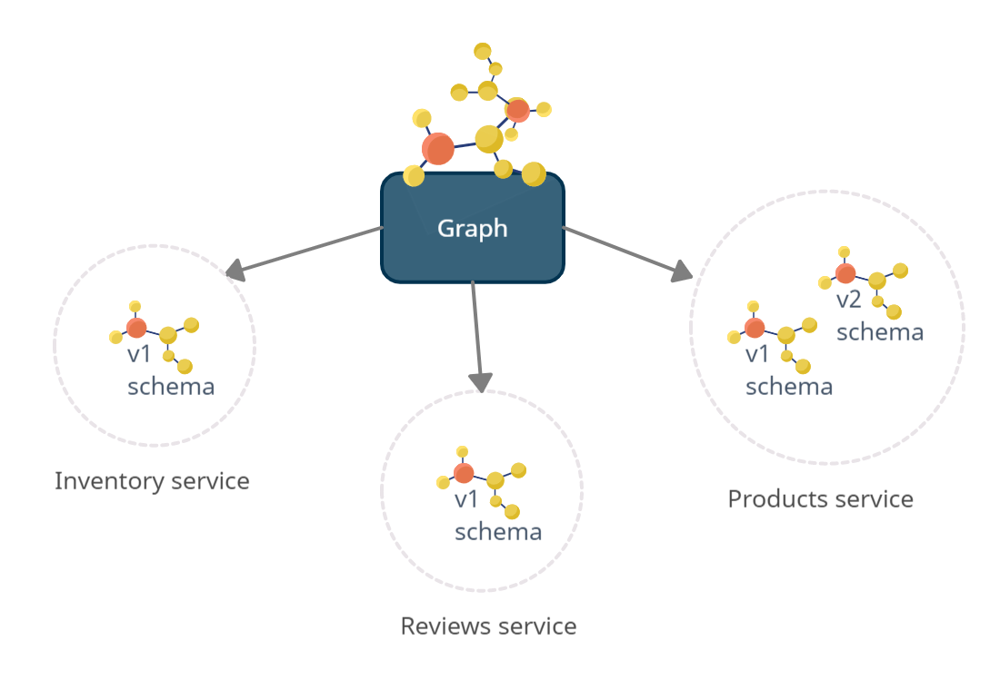

# Composition stability

Whenever a schema is pushed or fetched, Graph-Registry ensures that the schema is valid. You can't fetch or produce an invalid registry state. This doesn't imply that you can't break your schema from consumer perspective. Always use a [change report](#creates-a-change-report) to understand your schema update.

# Terminology

## One graph, many services

<div align="center">
  
</div>

- **Graph:** A graph consists of multiple schemas managed by different services. You can create multiple graphs to build any variant. From consumer perspective, the composed graph state is determined and validated at runtime.
- **Supergraph:** A supergraph describes a static composition of a `graph`. It's compliant with the [Apollo Supergraph specification](https://specs.apollo.dev/join/v0.1/).
- **Schema:** A schema describes the shape of the data graph of a single graphql server. A schema is always associated to one service.
- **Service:** A service represent a unique graph-server in your infrastructure for example `Products`. A service can manage multiple schemas in different versions (e.g `v1`, `v2`, `current`). The `current` version is [special](#register-a-schema). The term `service` reflects the real-world. There must be a federated service which is responsible to manage the schema.

# API

## Schema federation

### Get all Graphs

GET - `/graphs` Returns all registered graphs.

### Get latest schemas

GET - `/schema/latest?graphName=my_graph` Returns the last registered (time-based) schema definition of all services.

**Query**

- `graphName`: (string) The name of the graph

**Notice:** Work always with versions in production.

### Register a schema

POST - `/schema/push` Creates a new graph and schema for a service. If you omit the `version` field the schema is registered as `current` version. `current` is a mutable version that always points to the registered schema. The `routingUrl` is the URL that your gateway uses to communicate with the service in a federation architecture.

**Idempotent:** yes

**Notice:** A schema is normalized before it's stored in the database. Whitespaces are stipped.

**Notice:** The schema isn't validated for breaking-changes. Use a [change report](#creates-a-change-report) to understand the implications of your update.

<details>
<summary>Example Request</summary>
<p>

```jsonc
{
  "typeDefs": "type Query { hello: String }",
  "graphName": "my_graph",
  "serviceName": "foo",
  "version": "1", // optional, uses "current" by default
  "routingUrl": "http://products-graphql.svc.cluster.local:4001/graphql"
}
```

</p>
</details>

### Get latest schemas by versions

POST - `/schema/compose` Returns the last registered schema definition of all services based on passed services & their versions. If versions can't be found it fails. You can use the version `current` to fetch the latest schema that was pushed with the version `current`. This is useful for rapid development when you don't want to deal with versioning. For production use immutable versions.

**Notice:** The version `current` doesn't represent the latest schema. It's handled as a mutable version.

<details>
<summary>Example Request</summary>
<p>

```jsonc
{
  "graphName": "my_graph",
  "services": [{ "name": "foo", "version": "1" }]
}
```

</p>
</details>

### Get supergraph schema

POST - `/schema/supergraph` Returns the supergraph schema definition of all registered services. The supergraph is composed of the latest schema version of a service.

<details>
<summary>Example Request</summary>
<p>

```jsonc
{
  "graphName": "my_graph"
}
```

</p>
</details>

### Deactivate a schema

PUT - `/schema/deactivate` Deactivates a schema by id. The schema will no longer be part of any result. You can re-activate it by registering.

<details>
<summary>Example Request</summary>
<p>

```jsonc
{
  "schemaId": "916348424"
}
```

</p>
</details>

---

## Validation

### Creates a change report

POST - `/schema/check` Returns the schema report between provided and latest schema. It can detect breaking, dangerous and safe changes. This should be executed before a new schema is pushed.

**Idempotent:** yes

<details>
<summary>Example Request</summary>
<p>

```json
{
  "graphName": "my_graph",
  "typeDefs": "type Query { hello: String }",
  "serviceName": "foo"
}
```

</p>
</details>

### Creates a schema coverage report

POST - `/schema/coverage` Returns the schema coverage between provided documents and latest schema or service versions. It returns a detailed reports about type and field hits.

**Idempotent:** yes

<details>
<summary>Example Request</summary>
<p>

```json
{
  "graphName": "my_graph",
  "documents": [{ "name": "foo.graphql", "source": "query { hello }" }],
  "services": [{ "name": "foo", "version": "1" }] // optional
}
```

</p>
</details>

### Validate your schema

POST - `/schema/validate` Validate schema between provided and latest schema. It only verify if the schema can be composed.

**Idempotent:** yes

<details>
<summary>Example Request</summary>
<p>

```json
{
  "graphName": "my_graph",
  "typeDefs": "type Query { hello: String }",
  "serviceName": "foo"
}
```

</p>
</details>

### Validating client operations

POST - `/document/validate` Confirm that all client operations are supported by the latest schema.

**Idempotent:** yes

<details>
<summary>Example Request</summary>
<p>

```json
{
  "graphName": "my_graph",
  "documents": ["query { hello }"]
}
```

</p>
</details>

---

## Monitoring / Maintanance

### Remove all schemas except the most (N) recent

POST - `/schema/garbage_collect` Removes all schemas except the most recent N of every service. Returns the count removed schemas and versions. This could be called by a cron.

**Idempotent:** yes

<details>
<summary>Example Request</summary>
<p>

```jsonc
{
  "num_schemas_keep": 10 // minimum is 10
}
```

</p>
</details>

### Check if registry is reachable

GET - `/health` healthcheck endpoint.
